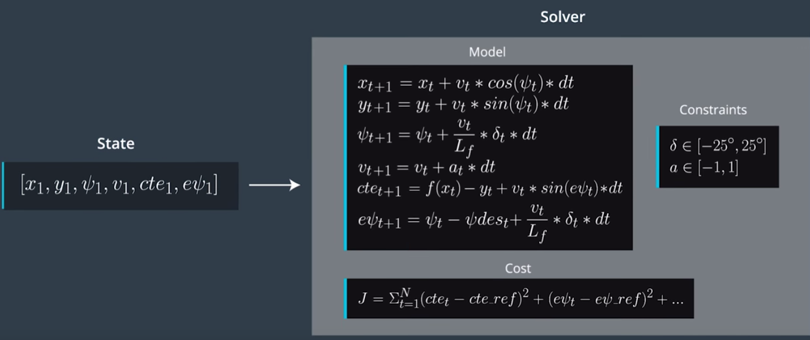

# CarND-Controls-MPC
Self-Driving Car Engineer Nanodegree Program

---

## Project writeup
### The model
The MPC model state is:
```
x - x position of the car. 0 with car being the origin
y - y position of the car. 0 with car being the origin
psi - the current yaw of the car. 0 at time 0 with car being the origin
v - the velocity of the car in m/s
cte - the cross track error, shortest distance from car to the planned path. Achieved by evaluating the reference path polynomial and evaluating at point of vehicle.
epsi - error in our yaw from desired yaw. Essentially the difference of the reference path tangential gradient vs current yaw.
```
The actuators:
```
delta - the steering angle, restricted between +-25 degrees.
a - acceleration, between -1 and 1.
```

update equations:



### Timestep Length and Elapsed Duration (N & dt)
It appeared when N is too high the algorithm would lag significantly. When N is too low it'd be wildly off road.

When dt is too low then N would need to be very high just to optimize for 1-2 seconds into the future. When dt is too high it'd optimize for the vehicle to turn too early.

A balance is required so N*dt is sufficient time into the future.

Range of N experimented with: 5 - 40
Range of dt experimented with: 0.025 - 0.5

Settled on N=10, dt=0.2

### Polynomial Fitting and MPC Preprocessing
The simulator provided a set of path points forward in the form of vector<double> ptsx & ptsx. These points were global positioning points. The simulator also provided the car's location globally.

Since it's easier to measure cross track error and psi error from the perspective of the vehicle's front direction, being the X axis, we calculate these points with respect to the car's location and rotate from global position to coordinates where the car is the centre.
```
//use negative psi to rotate the point towards 0, 0 being the direct front of the car
float s = sin(-psi);
float c = cos(-psi);

for(std::size_t i = 0; i < ptsx.size(); i++){
    double tempx = ptsx[i] - px;
    double tempy = ptsy[i] - py;

    ptsx[i] = tempx * c - tempy * s;
    ptsy[i] = tempx * s + tempy * c;
}
```

Once I could visualize the desired path in the simulator I fitted a 3rd degree polynomial to the points.
```
Eigen::VectorXd eigenX = Eigen::Map<Eigen::VectorXd, Eigen::Unaligned>(ptsx.data(), ptsx.size());
Eigen::VectorXd eigenY = Eigen::Map<Eigen::VectorXd, Eigen::Unaligned>(ptsy.data(), ptsy.size());

Eigen::VectorXd coeffs = polyfit(eigenX, eigenY, 3);
```
This gives us a model for the vehicle's desired trajectory.

Velocity was in mph so we need to convert this to m/s. This tripped me up for awhile.

### Model Predictive Control with Latency
Adding latency of 100ms threw off the controller significantly. The project mimics latency with the following:
```
this_thread::sleep_for(chrono::milliseconds(100));
```
To cater for latency, I implemented as suggested in the course material: to project forward 100ms before passing the state into the MPC.
```
double x = 0;
double y = 0;
psi = 0; //psi will be 0 since 0 will always be front

//simulate latency of 100ms
double latency = 0.1;
x = x + v * cos(psi) * latency;
y = y + v * sin(psi) * latency;
psi = - (v / 2.67) * delta * latency;
double cte = polyeval(coeffs, x);
double epsi = psi - atan(polyeval(coeffs, x));
v = v + a * latency;
```

Cost function weights had to be tuned again as well as the time steps and delta t.


## Dependencies

* cmake >= 3.5
 * All OSes: [click here for installation instructions](https://cmake.org/install/)
* make >= 4.1
  * Linux: make is installed by default on most Linux distros
  * Mac: [install Xcode command line tools to get make](https://developer.apple.com/xcode/features/)
  * Windows: [Click here for installation instructions](http://gnuwin32.sourceforge.net/packages/make.htm)
* gcc/g++ >= 5.4
  * Linux: gcc / g++ is installed by default on most Linux distros
  * Mac: same deal as make - [install Xcode command line tools]((https://developer.apple.com/xcode/features/)
  * Windows: recommend using [MinGW](http://www.mingw.org/)
* [uWebSockets](https://github.com/uWebSockets/uWebSockets)
  * Run either `install-mac.sh` or `install-ubuntu.sh`.
  * If you install from source, checkout to commit `e94b6e1`, i.e.
    ```
    git clone https://github.com/uWebSockets/uWebSockets
    cd uWebSockets
    git checkout e94b6e1
    ```
    Some function signatures have changed in v0.14.x. See [this PR](https://github.com/udacity/CarND-MPC-Project/pull/3) for more details.
* Fortran Compiler
  * Mac: `brew install gcc` (might not be required)
  * Linux: `sudo apt-get install gfortran`. Additionall you have also have to install gcc and g++, `sudo apt-get install gcc g++`. Look in [this Dockerfile](https://github.com/udacity/CarND-MPC-Quizzes/blob/master/Dockerfile) for more info.
* [Ipopt](https://projects.coin-or.org/Ipopt)
  * Mac: `brew install ipopt`
  * Linux
    * You will need a version of Ipopt 3.12.1 or higher. The version available through `apt-get` is 3.11.x. If you can get that version to work great but if not there's a script `install_ipopt.sh` that will install Ipopt. You just need to download the source from the Ipopt [releases page](https://www.coin-or.org/download/source/Ipopt/) or the [Github releases](https://github.com/coin-or/Ipopt/releases) page.
    * Then call `install_ipopt.sh` with the source directory as the first argument, ex: `sudo bash install_ipopt.sh Ipopt-3.12.1`.
  * Windows: TODO. If you can use the Linux subsystem and follow the Linux instructions.
* [CppAD](https://www.coin-or.org/CppAD/)
  * Mac: `brew install cppad`
  * Linux `sudo apt-get install cppad` or equivalent.
  * Windows: TODO. If you can use the Linux subsystem and follow the Linux instructions.
* [Eigen](http://eigen.tuxfamily.org/index.php?title=Main_Page). This is already part of the repo so you shouldn't have to worry about it.
* Simulator. You can download these from the [releases tab](https://github.com/udacity/self-driving-car-sim/releases).
* Not a dependency but read the [DATA.md](./DATA.md) for a description of the data sent back from the simulator.


## Basic Build Instructions


1. Clone this repo.
2. Make a build directory: `mkdir build && cd build`
3. Compile: `cmake .. && make`
4. Run it: `./mpc`.

## Tips

1. It's recommended to test the MPC on basic examples to see if your implementation behaves as desired. One possible example
is the vehicle starting offset of a straight line (reference). If the MPC implementation is correct, after some number of timesteps
(not too many) it should find and track the reference line.
2. The `lake_track_waypoints.csv` file has the waypoints of the lake track. You could use this to fit polynomials and points and see of how well your model tracks curve. NOTE: This file might be not completely in sync with the simulator so your solution should NOT depend on it.
3. For visualization this C++ [matplotlib wrapper](https://github.com/lava/matplotlib-cpp) could be helpful.

## Editor Settings

We've purposefully kept editor configuration files out of this repo in order to
keep it as simple and environment agnostic as possible. However, we recommend
using the following settings:

* indent using spaces
* set tab width to 2 spaces (keeps the matrices in source code aligned)

## Code Style

Please (do your best to) stick to [Google's C++ style guide](https://google.github.io/styleguide/cppguide.html).

## Project Instructions and Rubric

Note: regardless of the changes you make, your project must be buildable using
cmake and make!

More information is only accessible by people who are already enrolled in Term 2
of CarND. If you are enrolled, see [the project page](https://classroom.udacity.com/nanodegrees/nd013/parts/40f38239-66b6-46ec-ae68-03afd8a601c8/modules/f1820894-8322-4bb3-81aa-b26b3c6dcbaf/lessons/b1ff3be0-c904-438e-aad3-2b5379f0e0c3/concepts/1a2255a0-e23c-44cf-8d41-39b8a3c8264a)
for instructions and the project rubric.

## Hints!

* You don't have to follow this directory structure, but if you do, your work
  will span all of the .cpp files here. Keep an eye out for TODOs.

## Call for IDE Profiles Pull Requests

Help your fellow students!

We decided to create Makefiles with cmake to keep this project as platform
agnostic as possible. Similarly, we omitted IDE profiles in order to we ensure
that students don't feel pressured to use one IDE or another.

However! I'd love to help people get up and running with their IDEs of choice.
If you've created a profile for an IDE that you think other students would
appreciate, we'd love to have you add the requisite profile files and
instructions to ide_profiles/. For example if you wanted to add a VS Code
profile, you'd add:

* /ide_profiles/vscode/.vscode
* /ide_profiles/vscode/README.md

The README should explain what the profile does, how to take advantage of it,
and how to install it.

Frankly, I've never been involved in a project with multiple IDE profiles
before. I believe the best way to handle this would be to keep them out of the
repo root to avoid clutter. My expectation is that most profiles will include
instructions to copy files to a new location to get picked up by the IDE, but
that's just a guess.

One last note here: regardless of the IDE used, every submitted project must
still be compilable with cmake and make./
